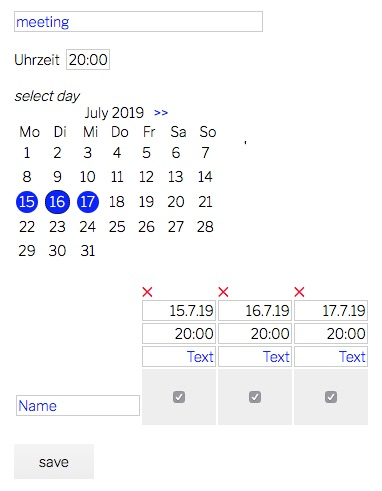

# terminplanner
no need for doodle(r)  
  
one php, one css and one vanilla javascript file that does it all  
* switch language
* mobile ready display
* quick date selection and availability
* stores data in local sqlite database
* no cookies, no registration, using browser hash
* export calendar ics
* subscribe calendar rss
* terminate entries with code word
* expires after event

