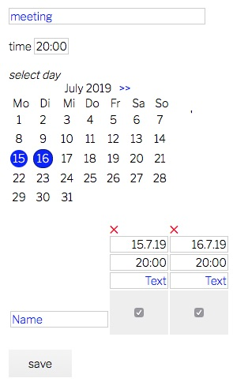

# terminplanner
no need for doodle(r)  
  
one php, one css and vanilla javascript file that does it all (28kb) 
* switch language
* mobile and desktop display
* quick date selection, editing and removal
* stores data in local sqlite database
* no cookies, no registration
* edit with identical browser hash
* export calendar ics
* user can subscribe to calendar rss
* admin can monitor calendar rss
* terminate entries with code word
* all entries removed after event

